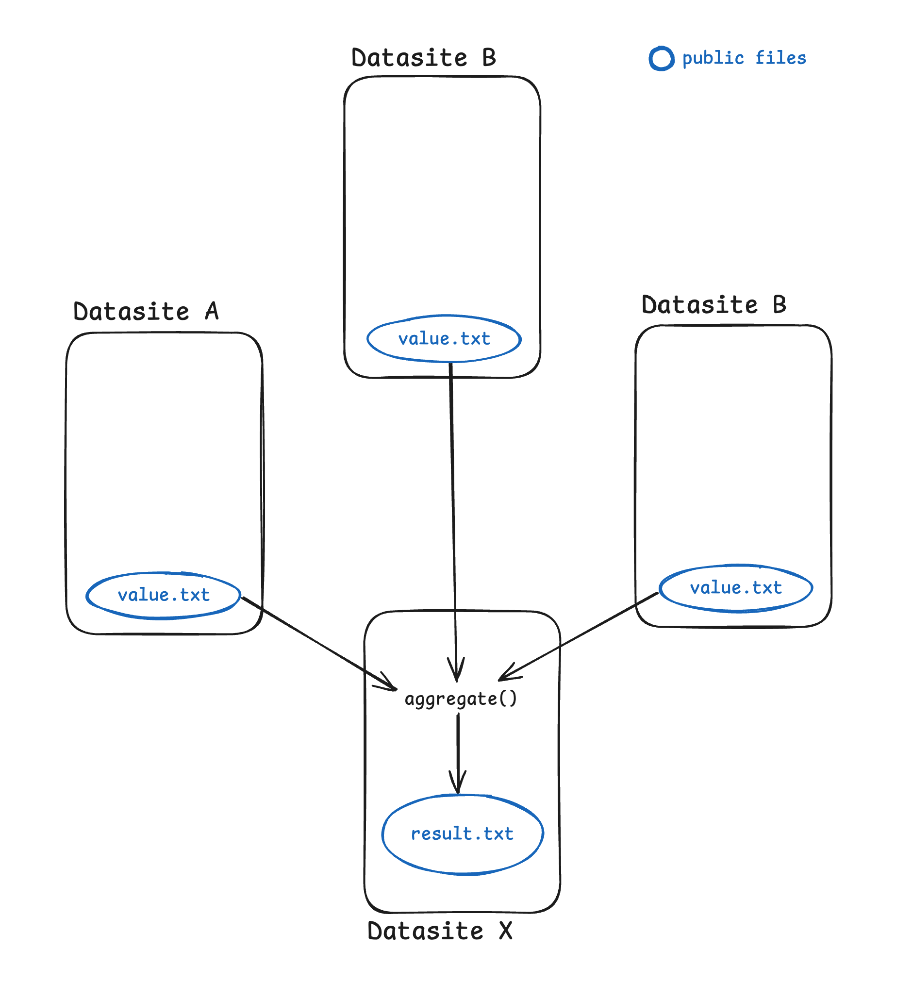

# Syftbox and DP

_Author:_ Matei Simtinică

## Add a layer of privacy

Since Syftbox is designed to allow developers to analyze data while leveraging PETs, let's walk through a brief example of how we could add a layer of anonymization on top of yesterday's aggregation app.

## Use case

Let's assume the values we need to aggregate result from a computation applied on a private dataset.

The computation is defined by the developer who wants to run a study, but the participants to the study want to make sure the results they'll make publicly available won't leak information about individual data points from the original dataset.

This is one of the simplest use-cases for using Differential Privacy.

## Aggregator recap

Yesterday's `aggregator` app looked at public values stored on other datasites and computed their sum (an aggregated value).

The workflow looks something like this:

<p align="center">
    
</p>

The `aggregator` app runs on Datasite X (which we can associate with a _researcher_) and assumes other datasites have a `value.txt` file which is **public**.

## Extend with DP

In a real-life scenario, that value could be computed from a _private dataset_. One issue with computing _public_ values from _private_ data is that aggregated outpus can unintentionally leak information about individual data points, exposing sensitive details if not carefully protected. DP (Differential Privacy) introduces noise in the results in a controlled way, ensuring that individual data points cannot be reverse-engineered or identified, thus preserving privacy without compromising the overall utility of the data. This is why we need DP.

**Note**: Check out [this short recap on DP](./DP_Recap.md) for more details on how this works.

In this tutorial we'll extend the `aggregator` workflow with another app, `dp_compute`, which will compute the public values (stored in `value.txt`) from a private dataset (`dataset.json`) on each participating datasite, using DP!

<p align="center">
    
</p>

**Important Observation**: `dp_compute` is designed to run on Datasites A, B and C, while the `aggregator` app will run on Datasite X.

We could dive deeper into how to configure the DP parameters, but for this tutorial let's assume they are stored alongside the dataset in each `dataset.json` file.

A private dataset could look like this:

```json
{
  "data": [1.2, 2.6, 0.9],
  "eps": 0.5,
  "bounds": [0.5, 3]
}
```

The computation that generates the public value that takes part in the aggregation could be anything. For this tutorial we'll use the _mean_ value:

```py
import diffprivlib.tools as dp

def compute_result(dataset):
    return dp.mean(
        dataset["data"],
        epsilon=dataset["eps"],
        bounds=dataset["bounds"],
    )
```

**Note**: `diffprivlib` is a Python library with various utilities for DP and needs to be installed (check out [their repository](https://github.com/IBM/differential-privacy-library?tab=readme-ov-file#setup) for more details on how to do that)

## Write the app

Having the workflow above in mind, we can scaffold an application that will compute the public values with DP:

```py
from syftbox.lib import Client
from pathlib import Path
import sys
import json
import diffprivlib.tools as dp


def compute_value(dataset):
    return dp.mean(
        dataset["data"],
        epsilon=dataset["eps"],
        bounds=dataset["bounds"],
    )


if __name__ == "__main__":
    client = Client.load()

    dataset_path = client.datasite_path / "datasets" / "dataset.json"
    value_path = client.datasite_path / "public" / "value.txt"

    with open(dataset_path) as f:
        dataset = json.load(f)

    value = compute_value(dataset)

    with open(value_path, "w") as f:
        f.write(str(value))
```

Now, Syftbox runs an application every 10 seconds, meaning that an app with the code above will regenerate a different public value every 10 seconds (since DP uses randomly generated noise for each computation).

This could cause issues down the pipeline, so we can extend our application to take this into consideration with a simple rule: if a `value.txt` file already exists, skip the computation.

We'll also check if `dataset.json` exists before attempting the computation. The new code will look like this:

```py
from syftbox.lib import Client
import sys
import json
import diffprivlib.tools as dp


def compute_value(dataset):
    return dp.mean(
        dataset["data"],
        epsilon=dataset["eps"],
        bounds=dataset["bounds"],
    )


if __name__ == "__main__":
    client = Client.load()

    dataset_path = client.datasite_path / "datasets" / "private_dataset.json"
    value_path = client.datasite_path / "public" / "value.txt"

    if value_path.exists():
        print("\n========== Compute ==========\n")
        print("value.txt file already exists. skipping execution...")
        print(f"to force a re-execution, delete the value.txt file at {value_path}")
        print("\n=============================\n")
        sys.exit(0)

    if not dataset_path.exists() or not dataset_path.is_file():
        print("\n========== Compute ==========\n")
        print(f"dataset not found at {dataset_path}. skipping computation...")
        print("\n=============================\n")
        sys.exit(0)

    with open(dataset_path) as f:
        dataset = json.load(f)

    value = compute_value(dataset)

    with open(value_path, "w") as f:
        f.write(str(value))

```

That's about it! We created an app on top of the `aggregator` workflow, which generates the values that are being aggregated from a _private_ dataset, using DP on Syftbox!

## Final observations

We now have a workflow that involves _two_ applications:

- `aggregator`, running _on a researcher's datasite_, and computes an aggregated value from public values stored on _other_ datasites
- `dp_compute`, designed to run on _other datasites_ (belonging to organizations or individuals willing to contribute with insights from their private data) that computes _public values_ from _private data_ in a privacy-preserving manner

**Note**: the `run.sh` entrypoint works the same as the `aggregator` app's entrypoint, so we'll just copy the one from the previous tutorial:

```sh
#!/bin/sh

uv venv
uv run main.py
```

You can find the code above in a [separate file here (`main.py`)](<[`main.py`](./main.py)>).

## Conclusions

This tutorials outlines how you can create a workflow that uses DP on top of Syftbox to protect the privacy of the data on other datasites taking part in data analysis experiments.

For the purpose of this tutorial series, we kept it pretty simple, but you can extend it however you think best fits your use-case. See you in the next tutorial!
