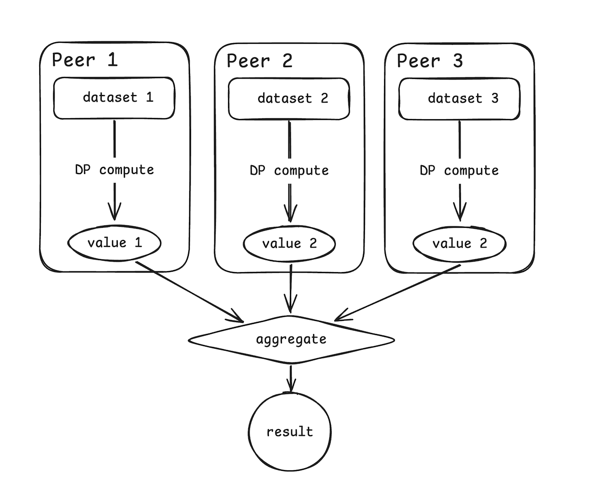

# Syftbox and DP

_Author:_ Matei Simtinică

## Add a layer of privacy

Since Syftbox is designed to allow developers to analyze data while leveraging PETs, let's walk through a brief example of how we could add a layer of anonymization on top of yesterday's aggregation app.

## Use case

Let's assume the values we need to aggregate result from a computation applied on a private dataset.

The computation is defined by the developer who wants to run a study, but the participants to the study want to make sure the results they'll make publicly available won't leak information about individual data points from the original dataset.

This is one of the simplest use-cases for using Differential Privacy.

## Workflow

Yesterday's aggregator app looked at public values stored on each peer's datasite and computed their sum. We'll extend this workflow with an application _designed for peers who own data_, aiming to provide them with the means of computing the value taking part in the aggregation while preserving the privacy of each data point taking part in the computation.



We could dive deeper into how to configure the DP parameters, but for this tutorial let's assume each data owner peer will specify them alongside their data.

A private dataset could look like this:

```json
{
  "data": [1.2, 2.6, 0.9],
  "eps": 0.5,
  "bounds": [0.5, 3]
}
```

The computation that generates each peer's value could be anything. For this tutorial we'll use the mean value:

```py
import diffprivlib.tools as dp

def compute_result(dataset):
    return dp.mean(
        dataset["data"],
        epsilon=dataset["eps"],
        bounds=dataset["bounds"],
    )
```

## Notes on development

Syftbox runs an application every 10 seconds, and we don't want to recompute the values every time, but only when the data changes. This is why we'll only run the computation when there is no `value.txt` file. When a data owner peer wants to re-execute a computation they simply need to delete `value.txt` and our app, with help from Syftbox, will take care of the rest.

## An app for data owner peers

Since this is an app designed for data owner peers, they need to install it on their local machine.

Their file structure should look like this:

```
SyftBox/
    sync/
        apps/
            dp_compute/
                run.sh
                main.py
    datasets/
        private_dataset.json
    public/
        value.txt (will be created by dp_compute)
```

## Final code

The main app logic deals with file IO, checking `value.txt` and computing the result using DP. You can find the code in the [`main.py`](./main.py) file.

## Conclusions

This tutorials outlines how you can create a workflow that uses DP on top of Syftbox to protect the privacy of the data owned by peers taking part in data analysis experiments.

For simplicity, we kept it pretty simple, but you can extend it however you think best fits your use-case. See you in the next tutorial!
